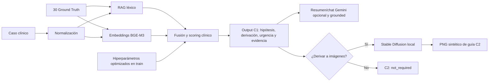

# OncoBridgeAI

Prototipo académico de apoyo a la decisión oncológica desarrollado para **IA Generativa para Datos Biomédicos**.

- **Componente 1:** compara una historia clínica con una base de conocimiento de 30 Ground Truth mediante RAG híbrido, prioriza hipótesis y decide si corresponde derivar a imágenes.
- **Componente 2:** cuando C1 recomienda derivación, genera localmente una referencia visual sintética con Stable Diffusion para orientar al radiólogo sobre el patrón esperado.
- **Interfaz:** Streamlit permite seleccionar cualquiera de los 110 casos, revisar sus datos y ejecutar el flujo completo con un solo botón.

El sistema usa datos sintéticos y **no está validado para uso clínico real ni reemplaza el juicio profesional**.

## Dataset: 30 Ground Truth y 110 casos clínicos

Son dos colecciones distintas:

| Colección | Cantidad | Función |
|---|---:|---|
| `oncology_ground_truth_base/` | 30 | Base de conocimiento consultada por el RAG. Cada GT describe una entidad clínica, evidencia esperada y guía radiológica. |
| `clinical_cases/` | 110 | Casos de evaluación. Cada carpeta contiene un `input.json` y un `expected_output.json`. |

Los 110 casos se dividen de forma estratificada y reproducible:

- **Train:** 77 casos. Se usa para optimizar pesos y umbrales.
- **Test:** 33 casos. Se reserva para una única evaluación final.

El optimizador no acepta un manifiesto que no declare `split="train"`. Tanto los manifiestos como los hiperparámetros incluyen una huella del dataset para evitar mezclar versiones.

## Arquitectura



### Arquitectura detallada del Componente 1

El Componente 1 es un pipeline RAG híbrido y explicable. Recupera hipótesis desde una base de 30 Ground Truth (GT), las contrasta con evidencia clínica estructurada del caso y emite una recomendación de derivación a imágenes. No entrena un modelo diagnóstico ni produce un diagnóstico autónomo.

#### 1. Datos, split y optimización

Los 110 casos clínicos sintéticos se dividen de forma estratificada y reproducible en 77 casos de **train** (70 %) y 33 de **test** (30 %). Los casos de train se usan para seleccionar los hiperparámetros; el test queda reservado y se evalúa una única vez después de congelar la configuración elegida.

`optimize_hyperparameters.py` ejecuta 150 trials de Optuna sobre train. En cada trial ajusta los pesos léxico/semántico del RAG, los seis pesos de evidencia clínica y los umbrales de decisión. La función objetivo es:

```text
score = (sensibilidad + especificidad + exactitud_de_GT) / 3
```

Si la sensibilidad es menor a 0,80, el score recibe una penalización. La sensibilidad prioriza no omitir casos que requerían imágenes; la especificidad limita derivaciones innecesarias; y la exactitud de GT mide si la primera hipótesis coincide con una entidad esperada. La configuración ganadora se guarda en `onco_bridge_c1/artifacts/best_hyperparameters.json` junto con la huella del dataset, para impedir reutilizarla si cambian los GT.

#### 2. Preparación de los 30 Ground Truth

Cada GT se representa de dos formas:

- **Semántica:** BGE-M3 genera un embedding normalizado para el documento clínico compacto del GT. Los embeddings de los 30 GT se guardan en caché para no recalcularlos en cada ejecución.
- **Léxica:** el contenido se normaliza (minúsculas, sin tildes ni puntuación, sin stopwords y con un diccionario acotado de sinónimos) y se convierte en un conjunto de términos. Esta representación se construye al iniciar el pipeline; no se persiste como archivo de caché.

#### 3. Camino de un caso clínico nuevo: recuperación híbrida

Al cargar un caso, C1 reúne demografía, síntomas actuales, antecedentes recientes y laboratorios. A ese texto le aplica la misma normalización y le calcula un embedding BGE-M3. Luego compara el caso contra los 30 GT con dos señales:

- **Similitud semántica:** similitud coseno entre el embedding normalizado del caso y el embedding de cada GT.
- **Score léxico:** proporción de términos normalizados del caso que también aparecen en el GT, más un pequeño refuerzo cuando el caso contiene términos asociados al órgano del GT.

La configuración optimizada vigente asigna un peso semántico de **0,329877** y un peso léxico de **0,670123**:

```text
score_hibrido = 0,670123 × score_lexico + 0,329877 × similitud_semantica
```

Los 30 GT se ordenan por `score_hibrido` y se conservan los **5 candidatos** con mayor similitud. Esta etapa solo recupera candidatos plausibles; todavía no define las hipótesis finales ni la derivación.

#### 4. Validación clínica y selección de hasta 3 hipótesis

Para cada uno de los 5 candidatos recuperados, C1 vuelve a comparar el caso normalizado con la evidencia específica del GT. Calcula seis señales:

| Evidencia | Peso optimizado | Cálculo |
|---|---:|---|
| RAG | 0,229457 | Score de recuperación híbrida, reescalado a un máximo de 1. |
| Síntomas | 0,232214 | Solapamiento entre términos del caso y síntomas esperados. |
| Hallazgos clínicos | 0,171297 | Solapamiento con hallazgos clínicos esperados. |
| Factores de riesgo | 0,061177 | Solapamiento con riesgos y antecedentes predisponentes. |
| Antecedentes | 0,079676 | Solapamiento con antecedentes o red flags de imágenes previas. |
| Biomarcadores | 0,226181 | Proporción de reglas de laboratorio del GT que cumple el paciente. |

El puntaje clínico es:

```text
score_clinico =
  0,229457 × RAG +
  0,232214 × sintomas +
  0,171297 × hallazgos +
  0,061177 × riesgo +
  0,079676 × antecedentes +
  0,226181 × biomarcadores
```

El score clínico se combina con la probabilidad base definida en cada GT. La probabilidad base es un prior heurístico del dataset sintético: no equivale a prevalencia ni a riesgo clínico poblacional.

```text
probabilidad_final =
  0,749423 × score_clinico +
  0,250577 × probabilidad_base_GT
```

Los candidatos se ordenan por `probabilidad_final`. C1 considera como máximo los tres primeros y solo devuelve aquellos que cumplen ambas condiciones: una probabilidad de al menos **0,227567** y evidencia explícita encontrada en el caso. Por eso el output puede contener de cero a tres hipótesis. Si ninguna supera los criterios, devuelve `SIN_ELEMENTOS_PARA_EVALUAR`.

#### 5. Urgencia y derivación a imágenes

La hipótesis principal determina inicialmente la urgencia: toma el campo `urgency_level` del GT (`alta`, `media` o `baja`), salvo que la categoría principal sea benigna, caso en el que la urgencia inicial es `ninguna`. Para valorar la necesidad de imágenes, C1 transforma la urgencia en un peso:

```text
alta = 1,0
media = 0,6
baja = 0,3
```

Y calcula la mayor probabilidad ponderada entre las hipótesis seleccionadas:

```text
probabilidad_imagenes = max(probabilidad_final_hipotesis × peso_urgencia)
```

Con la configuración vigente:

- Si `probabilidad_imagenes >= 0,369822`, recomienda `DERIVAR_A_IMAGEN`.
- Si la hipótesis principal es **benigna** y `probabilidad_imagenes < 0,321756`, recomienda `NO_DERIVAR`.
- En los demás casos, recomienda `SEGUIMIENTO_CLINICO` y asigna urgencia baja.
- Si no hay hipótesis válidas, devuelve `SIN_ELEMENTOS_PARA_EVALUAR` y urgencia ninguna.

Por lo tanto, el umbral bajo no implica `NO_DERIVAR` para cualquier caso: esa salida está reservada en el código para una hipótesis principal benigna. Un resultado intermedio, o un caso no benigno bajo el umbral de derivación, continúa como seguimiento clínico.

Los embeddings semánticos de los GT se guardan en `onco_bridge_c1/.cache/`. El repositorio incluye el archivo correspondiente al dataset vigente:

```text
gt_embeddings_8b0b40f7b7672f56.npy
```

Si falta o deja de coincidir con los GT o el modelo, el sistema lo regenera. BGE-M3 igualmente debe estar disponible para calcular el embedding de cada caso nuevo.

## Estructura

```text
TP-Final/
├── README.md
├── requirements.txt
├── .env.example
├── OncoBridge_AI_Assignment.md
├── dataset_clinical_only/
│   └── dataset/
│       ├── index.json
│       ├── oncology_ground_truth_base/   # 30 GT
│       └── clinical_cases/               # 110 casos
└── onco_bridge_c1/
    ├── app.py
    ├── run_component1.py
    ├── run_component2.py
    ├── run_end_to_end.py
    ├── split_dataset.py
    ├── optimize_hyperparameters.py
    ├── evaluate.py
    ├── data_splits/
    ├── artifacts/
    │   ├── best_hyperparameters.json
    │   └── evaluation_report_test.json
    ├── .cache/
    └── onco_bridge/
```

Solo se versionan los artefactos finales mínimos: hiperparámetros congelados, reporte final de test y caché semántica vigente. PNG, outputs de demo, reportes intermedios y trials de Optuna están ignorados.

## Guía de ejecución desde cero — PowerShell

Todos los comandos se ejecutan desde `TP-Final`.

### 1. Crear el entorno

Se recomienda Python 3.12.

```powershell
py -3.12 -m venv .venv
.\.venv\Scripts\Activate.ps1
python -m pip install --upgrade pip
pip install -r requirements.txt
```

Para C2, PyTorch debe detectar una GPU NVIDIA:

```powershell
python -c "import torch; print(torch.cuda.is_available())"
```

Si devuelve `False`, instalar en el mismo entorno la build CUDA indicada por la documentación oficial de PyTorch. La primera carga de BGE-M3 y Stable Diffusion puede descargar sus pesos; después se reutilizan desde caché.

### 2. Configurar Gemini — opcional

C1 y C2 funcionan sin Gemini. La API solo se usa para el resumen y chat de texto.

```powershell
Copy-Item .env.example .env
notepad .env
python onco_bridge_c1\test_gemini_api.py
```

Completar `GEMINI_API_KEY` únicamente en `.env`. El asistente está instruido para responder exclusivamente con el output de C1 y declarar cuando no existe evidencia suficiente.

### 3. Regenerar el split 70/30

```powershell
python onco_bridge_c1\split_dataset.py
```

Resultado esperado:

```text
Train: 77 casos | Test: 33 casos | seed: 20260712
```

### 4. Hiperparámetros

El repositorio ya incluye `onco_bridge_c1/artifacts/best_hyperparameters.json`, optimizado únicamente sobre los 77 casos de train. C1 lo carga automáticamente si su huella coincide con el dataset.

Para reproducir la búsqueda desde cero —puede tardar—:

```powershell
python onco_bridge_c1\optimize_hyperparameters.py --trials 150 --min-sensitivity 0.80
```

Este paso genera también `optimization_trials.csv`, que es un artefacto intermedio y no se versiona. Las métricas de train incluidas en el JSON sirven para selección de hiperparámetros, no como resultado final.

### 5. Ejecutar Componente 1

```powershell
python onco_bridge_c1\run_component1.py dataset_clinical_only\dataset\clinical_cases\case_001\input.json --output onco_bridge_c1\artifacts\c1_case_001.json
```

El comando imprime y guarda un JSON con hipótesis priorizadas, probabilidades de match, evidencia, probabilidad de requerir imagen, decisión, urgencia e instrucciones radiológicas.

### 6. Ejecutar Componente 2

```powershell
python onco_bridge_c1\run_component2.py onco_bridge_c1\artifacts\c1_case_001.json --device cuda --output-dir generated_references\case_001
```

Si C1 recomendó derivación, genera:

- `local_reference_<GT_ID>.png`
- `component2_output.json`

Si C1 no recomienda derivación, finaliza correctamente con `status="not_required"` y no fabrica una imagen.

### 7. Ejecutar el flujo end-to-end

```powershell
python onco_bridge_c1\run_end_to_end.py dataset_clinical_only\dataset\clinical_cases\case_001\input.json --reference-device cuda --output onco_bridge_c1\artifacts\end_to_end_case_001.json
```

El comando ejecuta C1 y, cuando corresponde, C2. Guarda un JSON integrado y el PNG sintético. Para un caso negativo completa el flujo con C2 en estado `not_required`.

### 8. Abrir la aplicación

```powershell
streamlit run onco_bridge_c1\app.py
```

La aplicación permite:

- seleccionar cualquiera de los 110 pacientes disponibles desde la historia clínica institucional;
- revisar identidad, antecedentes, síntomas, historia clínica y laboratorios;
- ejecutar C1 y C2 con un único botón;
- ver de forma inmediata la urgencia y la decisión binaria de derivación;
- ingresar al espacio del oncólogo para consultar el resumen, las hipótesis y el chat fundamentado en C1;
- ingresar al espacio del radiólogo, limitado a la guía radiológica, los positive/negative prompts, las zonas prioritarias y la referencia sintética;
- descargar el PNG sintético cuando corresponde.

### 9. Evaluación final de test

La secuencia metodológica es:

```text
split → optimización solo en train → congelar hiperparámetros → evaluar test una única vez
```

Comando:

```powershell
python onco_bridge_c1\evaluate.py --manifest onco_bridge_c1\data_splits\test_cases.json --report onco_bridge_c1\artifacts\evaluation_report_test.json
```

También se puede evaluar train durante el desarrollo o los 110 casos como análisis descriptivo:

```powershell
python onco_bridge_c1\evaluate.py --manifest onco_bridge_c1\data_splits\train_cases.json
python onco_bridge_c1\evaluate.py
```

No deben utilizarse esas dos corridas como estimación final de generalización.

## Casos de demo sugeridos

Ambos pertenecen a train, por lo que no revelan casos reservados de test.

### Caso positivo — `case_001`

```powershell
python onco_bridge_c1\run_end_to_end.py dataset_clinical_only\dataset\clinical_cases\case_001\input.json --reference-device cuda --output onco_bridge_c1\artifacts\demo_positive.json
```

Comportamiento esperado con la configuración versionada:

- hipótesis principal `GT-RENAL-001`;
- decisión `DERIVAR_A_IMAGEN`;
- urgencia alta;
- ejecución de C2 y generación de referencia sintética.

### Caso negativo — `case_031`

```powershell
python onco_bridge_c1\run_end_to_end.py dataset_clinical_only\dataset\clinical_cases\case_031\input.json --output onco_bridge_c1\artifacts\demo_negative.json
```

Comportamiento esperado:

- ninguna hipótesis con evidencia suficiente;
- decisión `SIN_ELEMENTOS_PARA_EVALUAR`;
- urgencia ninguna;
- C2 finaliza con `status="not_required"` sin necesitar GPU.

Los dos casos también pueden seleccionarse directamente desde Streamlit.

## Resultado final de test

Reporte versionado: `onco_bridge_c1/artifacts/evaluation_report_test.json`.

| Split | Casos | Match GT principal | Accuracy derivación | Sensibilidad | Especificidad | Brier derivación |
|---|---:|---:|---:|---:|---:|---:|
| **Test** | **33** | **51,52%** | **60,61%** | **83,33%** | **55,56%** | **0,2823** |

Matriz de confusión de test:

| TP | FP | FN | TN |
|---:|---:|---:|---:|
| 20 | 4 | 4 | 5 |

Otras métricas: accuracy de urgencia 57,58%, accuracy de conclusividad 90,91%, Brier de probabilidad del GT 0,2307 y correspondencia de guía radiológica 51,52%.

Estos números provienen de datos sintéticos educativos y no representan desempeño clínico real. La sensibilidad mínima de 80% fue una restricción de optimización sobre train; en test se obtuvo 83,33%.

## Limitaciones y trabajo futuro

- Los 110 casos son sintéticos y no fueron validados prospectivamente ni como cohorte externa.
- C1 recupera y rankea 30 GT; no es un modelo diagnóstico supervisado y sus scores no equivalen a riesgo clínico.
- El tamaño de la base, el solapamiento entre entidades y las reglas manuales limitan el match. Mejorarlo requiere una cohorte mayor, balanceada, revisada por especialistas y un modelo supervisado con calibración y validación externa.
- Optuna selecciona pesos y umbrales; no entrena un modelo clínico capaz de aprender representaciones nuevas.
- C2 es una **guía visual prospectiva**. No analiza imágenes reales, no detecta objetos, no segmenta lesiones y no produce ROI clínicamente validadas.
- Stable Diffusion es generalista. Su PNG es educativo, no pertenece al paciente y no debe interpretarse como evidencia.
- No se utilizó 3D MedDiffusion en la aplicación local porque requiere aproximadamente 40 GB de VRAM.
- Como mejora futura se necesitan estudios DICOM/NIfTI anonimizados, anotaciones de especialistas y un detector o segmentador evaluado con métricas por lesión/píxel.
- Para producción se requieren validación clínica, control de acceso, cifrado, auditoría, monitoreo de drift, versionado de modelos y contingencia.

## Privacidad y secretos

- Nunca subir `.env`; está ignorado por Git.
- `.env.example` contiene solo nombres de variables, sin valores reales.
- Si Gemini está configurado, la UI envía automáticamente el output de C1 para generar el resumen y responder el chat del oncólogo. En un despliegue hospitalario esta integración debe estar expresamente aprobada por la institución y configurada bajo sus políticas de privacidad y tratamiento de datos.
- C1, embeddings y generación de C2 son locales; ninguna imagen se envía a Gemini.
- Toda clave que alguna vez haya sido publicada debe considerarse comprometida y revocarse, aunque luego se elimine del repositorio.
- En producción deben usarse secretos administrados y rotación periódica, no archivos locales.

## Alcance de Gemini

Gemini es opcional y no interviene en el ranking, la derivación ni la generación de imágenes. Solo convierte el output estructurado de C1 a lenguaje natural y responde preguntas usando exclusivamente ese contexto. Ante información insuficiente debe declararlo y remitir la decisión al profesional.
