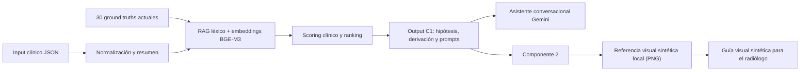

# OncoBridge AI

Sistema educativo de apoyo a la decisión oncológica desarrollado para el TP Final de **IA Generativa para Datos Biomédicos**. Conecta dos perfiles:

- **Componente 1 — oncólogo/clínico:** recupera ground truths relevantes mediante RAG híbrido, rankea hipótesis, estima si hace falta diagnóstico por imágenes y prepara instrucciones para radiología.
- **Componente 2 — radiólogo:** transforma la hipótesis de C1 en una **referencia visual sintética** de lo que se espera encontrar en CT/MRI, para orientar la lectura. De forma experimental, también puede recibir un estudio renderizado y devolver regiones de interés descriptivas.

Es un prototipo académico sobre datos sintéticos. **No está validado para uso clínico real ni reemplaza el juicio profesional.**

## Cambios incorporados en la consigna actualizada

El contrato funcional, las métricas, la estructura de entrega y los porcentajes de evaluación no cambiaron. Los cambios están en los ejemplos y en la cobertura clínica:

- Los ejemplos de carcinoma mamario/fibroadenoma/mastitis pasaron a adenocarcinoma pulmonar/hamartoma/neumonía.
- La base sigue teniendo **30 GT y 110 casos**, y se concentra en patologías de cabeza-cuello, tórax y abdomen.
- Se reemplazaron 10 GT antiguos por patologías renales, gástricas, hepatobiliares y suprarrenales: carcinoma renal, masa renal temprana, angiomiolipoma, quiste renal, pielonefritis, cáncer gástrico, colangiocarcinoma, hiperplasia nodular focal, carcinoma adrenocortical y adenoma suprarrenal.
- Las guías de imagen y los prompts de referencia ahora se concentran en **CT/MRI de cabeza-cuello, tórax y abdomen**.
- Los ejemplos de input/output, estudios radiológicos, próximos pasos y estructura del dataset fueron actualizados para esas patologías.

La consigna vigente es [OncoBridge_AI_Assignment.md](OncoBridge_AI_Assignment.md).

## Arquitectura



Los embeddings de los 30 GT se calculan localmente una vez y quedan en `onco_bridge_c1/.cache/`. Gemini solo se usa, de forma opcional, para el resumen y chat de texto de C1. C2 se ejecuta completamente local con Stable Diffusion.

## Estructura del entregable

```text
TP-Final/
├── README.md
├── requirements.txt
├── .env.example
├── OncoBridge_AI_Assignment.md
├── dataset_clinical_only/
│   └── dataset/
│       ├── index.json
│       ├── oncology_ground_truth_base/   # 30 GT
│       └── clinical_cases/               # 110 casos
├── onco_bridge_c1/
│   ├── app.py
│   ├── run_component1.py
│   ├── run_component2.py
│   ├── run_end_to_end.py
│   ├── split_dataset.py
│   ├── optimize_hyperparameters.py
│   ├── evaluate.py
│   ├── data_splits/
│   ├── artifacts/
│   └── onco_bridge/
```

Los archivos producidos durante una corrida (`artifacts/`, `.cache/` y `generated_references/`) no son parte del código fuente: se regeneran con los comandos de esta guía y están excluidos de Git.

## Guía de ejecución desde cero (PowerShell)

Todos los comandos siguientes se ejecutan desde la carpeta `TP-Final`.

### 1. Crear y activar el entorno

Se recomienda Python **3.12**. El proyecto admite Python 3.10 o superior, pero varias dependencias de ML todavía pueden no publicar ruedas compatibles con Python 3.14.

```powershell
py -3.12 -m venv .venv
.\.venv\Scripts\Activate.ps1
python -m pip install --upgrade pip
pip install -r requirements.txt
```

Para usar la generación local con GPU NVIDIA, PyTorch debe detectar CUDA en **ese mismo** entorno. Si `python -c "import torch; print(torch.cuda.is_available())"` devuelve `False`, instalar la build CUDA indicada en la [página oficial de PyTorch](https://pytorch.org/get-started/locally/) antes de ejecutar C2.

La primera ejecución semántica descarga `BAAI/bge-m3` desde Hugging Face y puede tardar. Luego los embeddings de los GT se reutilizan desde caché.

### 2. Configurar Gemini

```powershell
Copy-Item .env.example .env
notepad .env
```

Completar `GEMINI_API_KEY` y, si corresponde, cambiar el modelo de texto. C1 y C2 pueden funcionar sin Gemini; la API solo habilita el resumen y chat generativo de C1.

Probar la clave:

```powershell
python onco_bridge_c1\test_gemini_api.py
```

### 3. Generar el split reproducible 70/30

```powershell
python onco_bridge_c1\split_dataset.py
```

Genera manifiestos con punteros a los casos originales, sin copiarlos ni modificarlos:

- `onco_bridge_c1/data_splits/train_cases.json`: 77 casos.
- `onco_bridge_c1/data_splits/test_cases.json`: 33 casos.

### 4. Correr el Componente 1

El siguiente comando analiza un caso del dataset y muestra el JSON en consola:

```powershell
python onco_bridge_c1\run_component1.py dataset_clinical_only\dataset\clinical_cases\case_001\input.json
```

Para guardar el resultado:

```powershell
python onco_bridge_c1\run_component1.py dataset_clinical_only\dataset\clinical_cases\case_001\input.json --output onco_bridge_c1\artifacts\c1_case_001.json
```

El output visible contiene `matched_ground_truths`, probabilidades, instrucciones para el radiólogo, `recommendation`, `urgency` y uso estimado de tokens. Si todavía no existe una configuración optimizada, se usan valores por defecto seguros.

### 5. Optimizar hiperparámetros solo con train

```powershell
python onco_bridge_c1\optimize_hyperparameters.py --trials 150 --min-sensitivity 0.80
```

Genera:

- `onco_bridge_c1/artifacts/best_hyperparameters.json`.
- `onco_bridge_c1/artifacts/optimization_trials.csv`.

La función objetivo pesa por igual sensibilidad, especificidad y precisión del GT principal. Una huella del dataset impide cargar accidentalmente pesos aprendidos con la versión anterior. No se debe mirar test durante la optimización.

### 6. Evaluar C1

Train, para inspección durante el desarrollo:

```powershell
python onco_bridge_c1\evaluate.py --manifest onco_bridge_c1\data_splits\train_cases.json
```

Test, una única vez para el resultado final:

```powershell
python onco_bridge_c1\evaluate.py --manifest onco_bridge_c1\data_splits\test_cases.json
```

Los 110 casos:

```powershell
python onco_bridge_c1\evaluate.py
```

Los reportes se guardan en `onco_bridge_c1/artifacts/`. El evaluador verifica que el **primer GT** sea correcto, además de derivación, sensibilidad, especificidad, urgencia, conclusividad, calibración y correspondencia de la guía radiológica.

### 7. Correr el Componente 2

El objetivo del componente es generar la guía visual prospectiva para el radiólogo. Con el JSON de C1 ya generado, el siguiente comando produce un PNG y un JSON de metadatos en `generated_references\case_001_local\`:

```powershell
python onco_bridge_c1\run_component2.py onco_bridge_c1\artifacts\c1_case_001.json --device cuda --output-dir generated_references\case_001_local
```

La imagen `local_reference_<GT_ID>.png` es el output visual que acompaña al JSON de C1. No representa al paciente ni se interpreta como evidencia clínica.

### 8. Correr el flujo end-to-end

```powershell
python onco_bridge_c1\run_end_to_end.py dataset_clinical_only\dataset\clinical_cases\case_001\input.json --reference-device cuda --output onco_bridge_c1\artifacts\end_to_end_case_001.json
```

Este único comando encadena C1 y C2, guarda el JSON final y crea `onco_bridge_c1\artifacts\end_to_end_case_001_radiology_reference.png`. La ruta del PNG queda también dentro de `generated_radiology_reference.image_path` del JSON. No requiere Gemini: usa Stable Diffusion local y CUDA.

### 9. Abrir la interfaz

```powershell
streamlit run onco_bridge_c1\app.py
```

En la barra lateral se elige Componente 1 o Componente 2. C2 muestra el contexto de C1 y genera la referencia localmente; no carga ni envía estudios de imágenes.

## Dataset y resultados actuales

El dataset vigente contiene 30 GT y 110 casos sintéticos: 30 TP, 30 TN, 15 FP, 15 FN y 20 complejos. La partición estratificada fija usa 77 casos para train y 33 para test.

Como control de integración se ejecutó el pipeline con pesos por defecto y recuperación léxica de respaldo, porque el entorno de mantenimiento no tenía instaladas las dependencias de embeddings. Estos valores **no son el resultado final del modelo híbrido**:

| Split | GT principal | Accuracy derivación | Sensibilidad | Especificidad |
|---|---:|---:|---:|---:|
| Train (77) | 31.17% | 70.13% | 90.74% | 34.78% |
| Test (33) | 42.42% | 69.70% | 91.67% | 44.44% |

Antes de la entrega se debe ejecutar la optimización con BGE-M3 y reemplazar esta tabla por los resultados finales de train/test. Los JSON de este control quedan en `onco_bridge_c1/artifacts/`.

## Limitaciones conocidas y trabajo futuro

- Los casos son sintéticos, no fueron validados prospectivamente ni revisados como cohorte por especialistas certificados.
- C1 no es un modelo diagnóstico y sus probabilidades son scores calibrables, no riesgo clínico real.
- La precisión de match de GT puede ser baja porque el problema usa solo **30 ground truths y 110 casos sintéticos**; varias entidades comparten síntomas, estudios y diferenciales. El RAG recupera similitud léxica/semántica y el optimizador ajusta pesos, pero **no entrena un modelo predictivo supervisado** ni puede aprender patrones clínicos nuevos a partir de una cohorte tan pequeña. Para mejorar de forma sustentable se requeriría una base mucho mayor, curada y balanceada, con etiquetas revisadas por especialistas, particiones externas por centro y el entrenamiento/validación de un modelo de machine learning supervisado, además de calibración y análisis de sesgos. La optimización de hiperparámetros actual solo elige pesos de scoring; no sustituye ese entrenamiento.
- Los GT contienen instrucciones anatómicas prototípicas; la lateralidad debe ser revisada contra el caso antes de usar la guía.
- Hay una inconsistencia nominal entre los ejemplos de la consigna (`GT-LUNG-*`, `GT-HCC-*`, `GT-HAMARTOMA-*`) y los archivos realmente entregados (`GT-PULM-*`, `GT-HIGADO-*` y otros diferenciales). El sistema toma como fuente de verdad los IDs del dataset.
- No se utilizó 3D MedDiffusion en la aplicación local porque su repositorio oficial informa un mínimo de **40 GB de VRAM** para inferencia; ese hardware no está disponible en el entorno del proyecto. Para el entregable se eligió Stable Diffusion local, que puede ejecutarse con CUDA y genera la referencia rápidamente en una GPU de consumo. Sigue siendo un modelo generalista, no un generador médico validado.
- C2 fue redefinido como **guía visual prospectiva**: en lugar de detectar hallazgos sobre una imagen médica real, genera una imagen sintética de lo que se espera hallar según C1 y la entrega al radiólogo como orientación. No debe confundirse con una imagen del paciente ni con una predicción clínica.
- La futura mejora prioritaria es incorporar estudios reales anonimizados y anotados, y entrenar/validar un detector de objetos o un modelo de segmentación para localizar la patología en la imagen real. Recién entonces serían pertinentes métricas como IoU, sensibilidad y especificidad por píxel.
- Para producción harían falta anonimización DICOM, cifrado, control de acceso, auditoría, versionado de modelos, monitoreo de drift, validación clínica y un procedimiento de contingencia.

Trabajo futuro prioritario: adaptar C2 a DICOM/NIfTI, incorporar un segmentador médico validado, construir un dataset multimodal con máscaras de especialistas, calibrar probabilidades y evaluar sesgos por edad, sexo y centro de adquisición.

## Privacidad

No enviar PHI identificable a Gemini. La UI exige una confirmación explícita antes de usar servicios externos. Las claves se guardan en `.env`, archivo excluido de Git. En un despliegue real se requeriría anonimización previa, secretos administrados, cifrado en tránsito/reposo, mínimo privilegio y cumplimiento de Ley 26.529/HIPAA/GDPR según jurisdicción.
