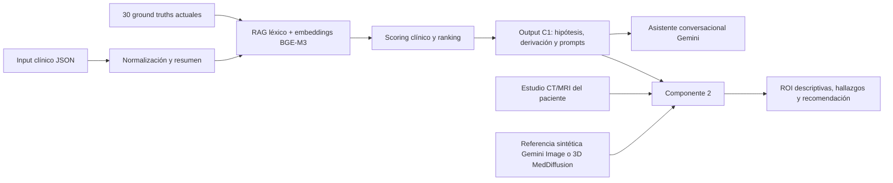

# OncoBridge AI

Sistema educativo de apoyo a la decisión oncológica desarrollado para el TP Final de **IA Generativa para Datos Biomédicos**. Conecta dos perfiles:

- **Componente 1 — oncólogo/clínico:** recupera ground truths relevantes mediante RAG híbrido, rankea hipótesis, estima si hace falta diagnóstico por imágenes y prepara instrucciones para radiología.
- **Componente 2 — radiólogo:** recibe el output de C1 y un estudio de CT/MRI, lo contrasta con los patrones esperados y devuelve regiones de interés descriptivas, hallazgos y una recomendación estructurada.

Es un prototipo académico sobre datos sintéticos. **No está validado para uso clínico real ni reemplaza el juicio profesional.**

## Cambios incorporados en la consigna actualizada

El contrato funcional, las métricas, la estructura de entrega y los porcentajes de evaluación no cambiaron. Los cambios están en los ejemplos y en la cobertura clínica:

- Los ejemplos de carcinoma mamario/fibroadenoma/mastitis pasaron a adenocarcinoma pulmonar/hamartoma/neumonía.
- La base sigue teniendo **30 GT y 110 casos**, pero elimina mama y próstata porque esas regiones no están contempladas por el flujo de 3D MedDiffusion propuesto.
- Se reemplazaron 10 GT antiguos por patologías renales, gástricas, hepatobiliares y suprarrenales: carcinoma renal, masa renal temprana, angiomiolipoma, quiste renal, pielonefritis, cáncer gástrico, colangiocarcinoma, hiperplasia nodular focal, carcinoma adrenocortical y adenoma suprarrenal.
- Las guías de imagen y los prompts de referencia ahora se concentran en **CT/MRI de cabeza-cuello, tórax y abdomen**.
- Los ejemplos de input/output, estudios radiológicos, próximos pasos y estructura del dataset fueron actualizados para esas patologías.

La consigna vigente es [OncoBridge_AI_Assignment.md](OncoBridge_AI_Assignment.md). La versión anterior se conserva localmente para trazabilidad dentro de `legacy/`, está excluida de Git y no es utilizada por el código.

## Arquitectura



Los embeddings de los 30 GT se calculan localmente una vez y quedan en `onco_bridge_c1/.cache/`. Gemini solo se usa para el resumen/chat y para interpretar imágenes en C2, siempre que el usuario lo habilite.

## Estructura del entregable

```text
TP-Final/
├── README.md
├── requirements.txt
├── .env.example
├── OncoBridge_AI_Assignment.md
├── dataset_clinical_only/
│   └── dataset/
│       ├── index.json
│       ├── oncology_ground_truth_base/   # 30 GT
│       └── clinical_cases/               # 110 casos
├── onco_bridge_c1/
│   ├── app.py
│   ├── run_component1.py
│   ├── run_component2.py
│   ├── run_end_to_end.py
│   ├── prepare_meddiffusion_references.py
│   ├── generate_reference_image.py
│   ├── split_dataset.py
│   ├── optimize_hyperparameters.py
│   ├── evaluate.py
│   ├── evaluate_component2.py
│   ├── data_splits/
│   ├── artifacts/
│   ├── notebooks/                         # Notebook Colab para 3D MedDiffusion
│   └── onco_bridge/
└── legacy/                               # archivo local anterior, excluido de Git
```

## Guía de ejecución desde cero (PowerShell)

Todos los comandos siguientes se ejecutan desde la carpeta `TP-Final`.

### 1. Crear y activar el entorno

Se recomienda Python **3.12**. El proyecto admite Python 3.10 o superior, pero varias dependencias de ML todavía pueden no publicar ruedas compatibles con Python 3.14.

```powershell
py -3.12 -m venv .venv
.\.venv\Scripts\Activate.ps1
python -m pip install --upgrade pip
pip install -r requirements.txt
```

La primera ejecución semántica descarga `BAAI/bge-m3` desde Hugging Face y puede tardar. Luego los embeddings de los GT se reutilizan desde caché.

### 2. Configurar Gemini

```powershell
Copy-Item .env.example .env
notepad .env
```

Completar `GEMINI_API_KEY` y, si corresponde, cambiar los nombres de modelo por modelos disponibles para esa clave. C1 puede funcionar sin Gemini; C2 y el chat generativo sí requieren la API.

Probar la clave:

```powershell
python onco_bridge_c1\test_gemini_api.py
```

### 3. Generar el split reproducible 70/30

```powershell
python onco_bridge_c1\split_dataset.py
```

Genera manifiestos con punteros a los casos originales, sin copiarlos ni modificarlos:

- `onco_bridge_c1/data_splits/train_cases.json`: 77 casos.
- `onco_bridge_c1/data_splits/test_cases.json`: 33 casos.

### 4. Correr el Componente 1

El siguiente comando analiza un caso del dataset y muestra el JSON en consola:

```powershell
python onco_bridge_c1\run_component1.py dataset_clinical_only\dataset\clinical_cases\case_001\input.json
```

Para guardar el resultado:

```powershell
python onco_bridge_c1\run_component1.py dataset_clinical_only\dataset\clinical_cases\case_001\input.json --output onco_bridge_c1\artifacts\c1_case_001.json
```

El output visible contiene `matched_ground_truths`, probabilidades, instrucciones para el radiólogo, `recommendation`, `urgency` y uso estimado de tokens. Si todavía no existe una configuración optimizada, se usan valores por defecto seguros.

### 5. Optimizar hiperparámetros solo con train

```powershell
python onco_bridge_c1\optimize_hyperparameters.py --trials 150 --min-sensitivity 0.80
```

Genera:

- `onco_bridge_c1/artifacts/best_hyperparameters.json`.
- `onco_bridge_c1/artifacts/optimization_trials.csv`.

La función objetivo pesa por igual sensibilidad, especificidad y precisión del GT principal. Una huella del dataset impide cargar accidentalmente pesos aprendidos con la versión anterior. No se debe mirar test durante la optimización.

### 6. Evaluar C1

Train, para inspección durante el desarrollo:

```powershell
python onco_bridge_c1\evaluate.py --manifest onco_bridge_c1\data_splits\train_cases.json
```

Test, una única vez para el resultado final:

```powershell
python onco_bridge_c1\evaluate.py --manifest onco_bridge_c1\data_splits\test_cases.json
```

Los 110 casos:

```powershell
python onco_bridge_c1\evaluate.py
```

Los reportes se guardan en `onco_bridge_c1/artifacts/`. El evaluador verifica que el **primer GT** sea correcto, además de derivación, sensibilidad, especificidad, urgencia, conclusividad, calibración y correspondencia del prompt MedDiffusion.

### 7. Generar referencias sintéticas para C2

#### Alternativa integrada: Gemini Image

Genera una ilustración radiológica sintética desde el prompt de la hipótesis principal de C1. Reutiliza `GEMINI_API_KEY`, pero requiere que la clave tenga acceso al modelo configurado en `GEMINI_IMAGE_MODEL`.

```powershell
python onco_bridge_c1\generate_reference_image.py onco_bridge_c1\artifacts\c1_case_001.json --output-dir generated_references\case_001
```

Genera una imagen y `metadata.json`. Puede cargarse en Streamlit desde Componente 2 o pasarse mediante `--reference-image`. Es una referencia educativa sintetizada por un modelo generalista: no es un estudio real, no está validada clínicamente y no debe utilizarse como evidencia diagnóstica.

#### Opción GPU externa: 3D MedDiffusion en Google Colab

El notebook [meddiffusion_colab_component2.ipynb](onco_bridge_c1/notebooks/meddiffusion_colab_component2.ipynb) implementa inferencia del [repositorio oficial 3D MedDiffusion](https://github.com/ShanghaiTech-IMPACT/3D-MedDiffusion), exporta un corte PNG y explica cómo adjuntarlo a C2. Requiere una GPU con al menos 40 GB de VRAM según ese repositorio.

#### Exportar manifiesto de prompts

El dataset no contiene imágenes. Este script conserva los prompts, negative prompts, modalidades y nombres sugeridos por C1:

```powershell
python onco_bridge_c1\prepare_meddiffusion_references.py onco_bridge_c1\artifacts\c1_case_001.json --output-dir meddiffusion_references\case_001
```

El archivo `manifest.json` es la entrada reproducible para elegir anatomía y documentar la referencia. Los pesos públicos de 3D MedDiffusion son condicionales por anatomía/modalidad, no por texto ni patología, por lo que no pueden garantizar una lesión específica.

### 8. Correr el Componente 2

Primero se puede generar una imagen **no médica** para comprobar que el contrato completo funciona:

```powershell
python onco_bridge_c1\create_demo_assets.py
python onco_bridge_c1\run_component2.py onco_bridge_c1\artifacts\c1_case_001.json onco_bridge_c1\demo_assets\non_medical_test_image.png --modality abdominal_CT --view "prueba técnica" --output onco_bridge_c1\artifacts\c2_demo.json
```

El output esperado es un JSON visible con clasificación `imagen_no_evaluable`: esto valida la integración, no la capacidad radiológica. Para una prueba significativa, reemplazar la imagen por una captura PNG/JPG/WEBP de CT/MRI y agregar opcionalmente una o más referencias con `--reference-image ruta\referencia.png`. En Streamlit también se puede generar una referencia Gemini Image directamente desde C2. C2 separa explícitamente el estudio real de las referencias. Las ROI actuales son descriptivas; no constituyen una máscara pixel a pixel validada.

### 9. Correr el flujo end-to-end

```powershell
python onco_bridge_c1\run_end_to_end.py dataset_clinical_only\dataset\clinical_cases\case_001\input.json onco_bridge_c1\demo_assets\non_medical_test_image.png --modality abdominal_CT --view "prueba técnica" --output onco_bridge_c1\artifacts\end_to_end_demo.json
```

Este único comando encadena C1 y C2 y produce un resultado visible. Requiere `GEMINI_API_KEY` por el análisis visual de C2. Para el caso real se reemplaza la imagen de prueba y, si se desea, se agrega `--reference-image`.

### 10. Abrir la interfaz

```powershell
streamlit run onco_bridge_c1\app.py
```

En la barra lateral se elige Componente 1 o Componente 2. C2 muestra los prompts de referencia, permite adjuntar las imágenes sintéticas y exige confirmación antes de enviar datos a Gemini.

### 11. Evaluar segmentación de C2

Cuando se disponga de imágenes y máscaras binarias anotadas, copiar `onco_bridge_c1/component2_eval_manifest.example.json`, completar las rutas y ejecutar:

```powershell
python onco_bridge_c1\evaluate_component2.py C:\ruta\component2_eval_manifest.json --report onco_bridge_c1\artifacts\component2_evaluation.json
```

Produce IoU, sensibilidad y especificidad por píxel. El dataset entregado por la cátedra no permite calcular estas métricas porque no incluye imágenes ni máscaras.

## Dataset y resultados actuales

El dataset vigente contiene 30 GT y 110 casos sintéticos: 30 TP, 30 TN, 15 FP, 15 FN y 20 complejos. La partición estratificada fija usa 77 casos para train y 33 para test.

Como control de integración se ejecutó el pipeline con pesos por defecto y recuperación léxica de respaldo, porque el entorno de mantenimiento no tenía instaladas las dependencias de embeddings. Estos valores **no son el resultado final del modelo híbrido**:

| Split | GT principal | Accuracy derivación | Sensibilidad | Especificidad |
|---|---:|---:|---:|---:|
| Train (77) | 31.17% | 70.13% | 90.74% | 34.78% |
| Test (33) | 42.42% | 69.70% | 91.67% | 44.44% |

Antes de la entrega se debe ejecutar la optimización con BGE-M3 y reemplazar esta tabla por los resultados finales de train/test. Los JSON de este control quedan en `onco_bridge_c1/artifacts/`.

## Limitaciones conocidas y trabajo futuro

- Los casos son sintéticos, no fueron validados prospectivamente ni revisados como cohorte por especialistas certificados.
- C1 no es un modelo diagnóstico y sus probabilidades son scores calibrables, no riesgo clínico real.
- Los GT contienen instrucciones anatómicas prototípicas; la lateralidad debe ser revisada contra el caso antes de usar la guía.
- Hay una inconsistencia nominal entre los ejemplos de la consigna (`GT-LUNG-*`, `GT-HCC-*`, `GT-HAMARTOMA-*`) y los archivos realmente entregados (`GT-PULM-*`, `GT-HIGADO-*` y otros diferenciales). El sistema toma como fuente de verdad los IDs del dataset.
- C2 usa Gemini Vision sobre imágenes renderizadas, no procesa volúmenes DICOM/NIfTI completos.
- Las ROI de C2 son descriptivas; una evaluación IoU real exige un segmentador, máscaras y un dataset radiológico anotado.
- Gemini Image y 3D MedDiffusion producen referencias sintéticas educativas; ninguna sustituye imágenes reales ni está validada para diagnóstico. Los pesos públicos de 3D MedDiffusion controlan anatomía/modalidad, no lesiones específicas.
- Para producción harían falta anonimización DICOM, cifrado, control de acceso, auditoría, versionado de modelos, monitoreo de drift, validación clínica y un procedimiento de contingencia.

Trabajo futuro prioritario: adaptar C2 a DICOM/NIfTI, incorporar un segmentador médico validado, construir un dataset multimodal con máscaras de especialistas, calibrar probabilidades y evaluar sesgos por edad, sexo y centro de adquisición.

## Privacidad

No enviar PHI identificable a Gemini. La UI exige una confirmación explícita antes de usar servicios externos. Las claves se guardan en `.env`, archivo excluido de Git. En un despliegue real se requeriría anonimización previa, secretos administrados, cifrado en tránsito/reposo, mínimo privilegio y cumplimiento de Ley 26.529/HIPAA/GDPR según jurisdicción.
