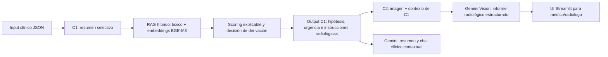

# OncoBridge AI — Componentes 1 y 2

Sistema académico de apoyo a la decisión oncológica para la materia **IA Generativa para Datos Biomédicos**. El sistema asiste a profesionales de salud; no emite diagnósticos definitivos ni reemplaza el juicio clínico.

## Objetivo del proyecto

OncoBridge AI acerca una base de conocimiento oncológico curada al punto de decisión clínica mediante dos componentes secuenciales:

1. **Componente 1 (C1):** analiza el contexto clínico estructurado del paciente, recupera hipótesis desde el ground truth oncológico y estima la necesidad y urgencia de derivar a estudios de imagen.
2. **Componente 2 (C2):** recibe el output de C1 más un estudio de imagen y genera un informe radiológico estructurado de apoyo, contrastando las hipótesis e instrucciones clínicas con la imagen cargada.

## Arquitectura



### Decisiones de diseño

- **RAG híbrido:** combina coincidencias léxicas, sinónimos clínicos, señales de órgano y embeddings multilingües BGE-M3.
- **Scoring explicable:** los pesos para recuperación, síntomas, hallazgos, riesgo, antecedentes y biomarcadores son configurables y optimizables.
- **C1 local:** el RAG y los embeddings se ejecutan localmente. La primera ejecución descarga el modelo BGE-M3 y luego reutiliza los embeddings GT desde caché.
- **C2 y capa conversacional:** usan Gemini solo cuando el usuario confirma que puede enviar el output anonimizado o la imagen al proveedor externo.

## Estructura del proyecto

```text
TP-Final/
├── dataset_clinical_only/              # Dataset y ground truth incluidos
├── OncoBridge_AI_Assignment (1).md     # Consigna original
└── onco_bridge_c1/
    ├── app.py                          # UI Streamlit de C1 y C2
    ├── run_component1.py               # Ejecución de C1 por consola
    ├── run_component2.py               # Ejecución de C2 por consola
    ├── run_end_to_end.py               # Flujo C1 → C2 en un comando
    ├── evaluate.py                     # Evaluación automatizada de C1
    ├── optimize_hyperparameters.py     # Optimización con train
    ├── split_dataset.py                # Manifiestos train/test reproducibles
    ├── test_gemini_api.py              # Prueba de conectividad Gemini
    ├── best_hyperparameters.json       # Mejor configuración encontrada en train
    ├── data_splits/                    # IDs de casos train/test
    ├── onco_bridge/
    │   ├── pipeline.py                 # Implementación de C1
    │   ├── semantic.py                 # Embeddings y caché local
    │   ├── component2.py               # Implementación de C2
    │   └── clinical_assistant.py       # Resumen y chat contextual
    ├── requirements.txt
    └── .env.example
```

## Dataset de evaluación

El repositorio incluye `dataset_clinical_only/dataset/` con:

- **30 entradas** de ground truth oncológico y diferenciales benignos.
- **110 casos clínicos**; cada caso incluye `input.json` y `expected_output.json`.
- Un índice general en `index.json`.
- Una división reproducible: **77 casos de train** y **33 de test**, estratificada por categoría.

El dataset cubre los órganos y diagnósticos diferenciales definidos por la consigna. Es sintético y no debe usarse para decisiones clínicas reales.

### Alcance de C2

El dataset entregado no contiene estudios de imagen ni máscaras de segmentación. Por eso C2 acepta una imagen PNG, JPG o WEBP proporcionada por el usuario y genera ROI **descriptivas**, no segmentación pixel a pixel. No se pueden calcular IoU ni métricas de segmentación válidas sin imágenes y anotaciones de ground truth adicionales.

## Requisitos

- Python **3.10 o superior**. El desarrollo se realizó con Python 3.12.
- Conexión a internet en la primera descarga de BGE-M3.
- Una API key de Gemini para el resumen generativo, chat y C2. C1 puede ejecutarse sin Gemini si no se usa la UI conversacional ni C2.

## Guía de ejecución desde cero

Todos los comandos siguientes son para **PowerShell**.

### 1. Crear y activar el entorno

Desde la raíz del repositorio:

```powershell
py -3.12 -m venv .venv
.\.venv\Scripts\Activate.ps1
python --version
cd onco_bridge_c1
pip install -r requirements.txt
```

El último comando instala todas las dependencias del proyecto. La primera ejecución semántica puede tardar más porque descarga BGE-M3.

### 2. Configurar variables de entorno

Copiar el ejemplo sin exponer claves reales:

```powershell
Copy-Item .env.example .env
```

Editar `.env` y completar:

```text
GEMINI_API_KEY=tu_clave_real
GEMINI_MODEL=gemini-3.5-flash
GEMINI_VISION_MODEL=gemini-3.5-flash
```

No subir `.env` al repositorio. Para probar la conexión con un prompt no clínico:

```powershell
python test_gemini_api.py
```

### 3. Crear la división train/test

```powershell
python split_dataset.py
```

Esto genera `data_splits/train_cases.json` y `data_splits/test_cases.json`. Son manifiestos de IDs; no copian ni modifican los casos originales.

### 4. Ejecutar Componente 1

Ejecutar C1 sobre un caso incluido en el dataset:

```powershell
python run_component1.py ..\dataset_clinical_only\dataset\clinical_cases\case_001\input.json --config best_hyperparameters.json --output c1_case_001.json
```

El comando imprime y guarda un JSON con esta estructura resumida:

```json
{
  "patient_id": "PAT-00101",
  "matched_ground_truths": [{"gt_id": "GT-...", "match_probability": 0.0}],
  "imaging_needed_probability": 0.0,
  "recommendation": "DERIVAR_A_IMAGEN",
  "urgency": "alta",
  "conclusive": true
}
```

Los valores concretos dependen de la configuración y del caso analizado.

### 5. Ejecutar Componente 2

C2 necesita un output de C1 y una imagen de estudio autorizada. Ejemplo:

```powershell
python run_component2.py c1_case_001.json ruta\a\estudio.png --modality mammography --view "MLO + CC bilateral" --output c2_case_001.json
```

El output incluye regiones de interés descriptivas, hallazgos, clasificación, confianza, recomendación y próximos pasos:

```json
{
  "patient_id": "PAT-00101",
  "segmentation": {"regions_of_interest": [{"id": "ROI-01", "location": "...", "size_mm": null}]},
  "findings": "...",
  "classification": "indeterminado",
  "confidence": 0.0,
  "final_recommendation": "...",
  "next_steps": ["..."],
  "token_usage": {"model": "gemini-3.5-flash"}
}
```

### 6. Ejecutar el flujo end-to-end

El siguiente comando encadena C1 y C2 y guarda ambos outputs en un único archivo:

```powershell
python run_end_to_end.py ..\dataset_clinical_only\dataset\clinical_cases\case_001\input.json ruta\a\estudio.png --modality mammography --view "MLO + CC bilateral" --output end_to_end_output.json
```

### 7. Ejecutar la evaluación

Evaluar todos los 110 casos:

```powershell
python evaluate.py --config best_hyperparameters.json
```

Evaluar el conjunto de train:

```powershell
python evaluate.py --manifest data_splits\train_cases.json --config best_hyperparameters.json
```

Evaluar el conjunto final reservado de test:

```powershell
python evaluate.py --manifest data_splits\test_cases.json --config best_hyperparameters.json
```

### 8. Optimizar hiperparámetros

La optimización usa solo train. Una prueba breve:

```powershell
python optimize_hyperparameters.py --trials 20 --min-sensitivity 0.80
```

Para una búsqueda más completa:

```powershell
python optimize_hyperparameters.py --trials 50 --min-sensitivity 0.80
```

Genera `best_hyperparameters.json` y `optimization_trials.csv`.

### 9. Usar la UI Streamlit

```powershell
streamlit run app.py
```

En la UI:

1. Entrar a **Componente 1** y cargar un `input.json` clínico.
2. Analizar el caso, leer el resumen y usar el chat contextual.
3. Entrar a **Componente 2**, cargar una imagen, elegir modalidad/vista/fecha y analizar el estudio.
4. Confirmar en la barra lateral el envío al proveedor de IA antes de usar Gemini.

## Resultados obtenidos

La configuración actual fue optimizada con 50 trials sobre los 77 casos de train, con sensibilidad mínima de 0.80 y objetivo equilibrado entre sensibilidad, especificidad y GT match accuracy.

| Métrica (train) | Resultado |
|---|---:|
| GT match accuracy | 62.34% |
| Referral accuracy | 63.64% |
| Sensibilidad | 85.19% |
| Especificidad | 60.87% |
| Verdaderos positivos / falsos positivos | 46 / 9 |
| Falsos negativos / verdaderos negativos | 8 / 14 |

Estos resultados son de ajuste y **no** deben reportarse como desempeño final. La métrica final debe obtenerse ejecutando la evaluación sobre `test_cases.json` una vez congelada la configuración.

## Limitaciones conocidas

- Ground truth y casos clínicos sintéticos; no validados por especialistas certificados.
- Los casos cubren solo el alcance del dataset provisto; no incluye pediatría, embarazo ni toda la variedad oncológica real.
- Las probabilidades y umbrales son aproximaciones del proyecto, no estimaciones clínicas calibradas en población real.
- C2 depende de una API externa de Gemini y de una imagen proporcionada por el usuario.
- C2 no tiene un dataset de imágenes ni segmentaciones anotadas, por lo que sus ROI son descriptivas y no se informan métricas IoU, sensibilidad de lesiones ni especificidad radiológica.
- En el uso de Gemini, el output de C1 y la imagen de C2 se envían al proveedor externo tras consentimiento; se deben anonimizar los datos y aplicar controles de privacidad apropiados.

## Trabajo futuro

- Incorporar un dataset de imágenes con permisos de uso y máscaras/etiquetas para evaluar C2 objetivamente.
- Implementar segmentación validada y métricas IoU, sensibilidad y especificidad de hallazgos.
- Añadir re-ranking clínico y evaluación de calibración por subgrupo.
- Validar el flujo con especialistas, casos externos y revisión de sesgos.
- Desplegar el sistema como servicio persistente con autenticación, auditoría, cifrado y gestión de secretos.
- Reemplazar la carga manual de archivos por integración controlada con HCE/PACS.

## Checklist de entrega

- [ ] Subir el repositorio a GitHub como **privado**.
- [ ] Habilitar acceso al docente.
- [ ] Verificar que `.env`, cachés y outputs temporales no se suban.
- [ ] Ejecutar la evaluación final de test y registrar sus métricas.
- [ ] Agregar una imagen de demo autorizada o documentar su origen para demostrar C2 end-to-end.
- [ ] Grabar la demo en Loom con un caso positivo y uno negativo para C1.
